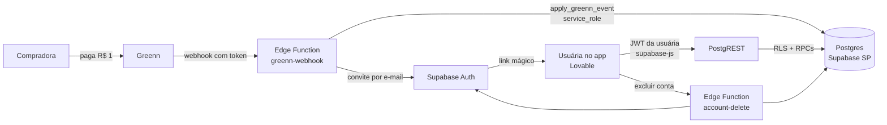

# Arquitetura

## Visão geral

## Decisões

| Decisão | Motivo |
| --- | --- |
| Supabase em São Paulo | Dados no Brasil, Postgres padrão de mercado, login pronto, sem servidor para manter |
| Regras de negócio em SQL (RPC) | Ficam perto dos dados, são testadas num Postgres real e valem para qualquer tela futura (app, web, IA) |
| RLS em todas as tabelas, sem exceção | O navegador é território hostil: mesmo com bug na tela, uma usuária não lê dados de outra |
| Escritas sensíveis só por RPC `SECURITY DEFINER` | Pontos, assinatura e diagnóstico não podem ser forjados pelo navegador |
| Cadastro fechado, entrada por convite | Só entra quem pagou; reduz contas falsas e abuso |
| Webhook idempotente e ordenado | A Greenn pode reenviar ou mandar fora de ordem; o banco decide o que vale |
| Conteúdo do método em tabelas | Novas trilhas e as 12 áreas entram por migração, sem mexer em código de tela |

## Modelo de dados

| Tabela | Conteúdo | Quem escreve |
| --- | --- | --- |
| `profiles` | Nome, negócio, mapa (faturamento, meta, travas, tempo) | Usuária (colunas liberadas) |
| `consents` | Histórico de consentimentos com versão do documento | Usuária (só acrescenta) |
| `subscriptions` | Status da assinatura vindo da Greenn | Só o webhook |
| `diagnostic_results` | Respostas, notas, foco e força | Só `submit_diagnostic` |
| `task_completions` | Missões concluídas por plano | Só `set_task_completion` |
| `daily_offering_log` | Dias com entrega do dia | Só `mark_daily_offering` |
| `stages`, `diagnostic_questions`, `plan_tasks`, `archetypes`, `daily_offerings`, `levels` | Conteúdo do método | Só migrações |
| `private.provider_events` | Eventos da Greenn sem dados pessoais | Só o webhook |
| `private.audit_log` | Ações sensíveis | Só funções do servidor |

## Funções chamadas pelo app (RPC)

| Função | O que faz |
| --- | --- |
| `submit_diagnostic(answers smallint[12])` | Exige assinatura e consentimento `dados_sensiveis`; calcula notas, foco e força |
| `set_task_completion(task_id, done)` | Marca ou desmarca missão do plano atual |
| `mark_daily_offering()` | Registra a entrega do dia (uma por dia, horário de Brasília) |
| `get_my_progress()` | Pontos, título, sequência, plano atual e se o acesso está ativo |
| `export_my_data()` | Exporta todos os dados da titular (LGPD) |
| `admin_subscription_summary()` | Totais por status (só admin) |

## Como crescer sem jogar fora

- **Mentoras de IA (Sprint 4):** nova edge function que chama o modelo de IA com a chave no servidor,
  limite de uso por usuária em tabela própria e checagem de `has_active_access`.
- **Comunidade (Sprint 6):** Supabase Realtime com RLS por sala, tabela de denúncias e bloqueio.
- **Vitrine (Sprint 7):** tabelas de ofertas e vouchers com resgate por RPC (um por usuária).
- **Escala:** índices já cobrem as consultas por usuária; o Supabase escala o Postgres por plano.
